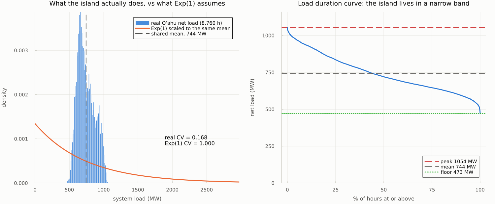
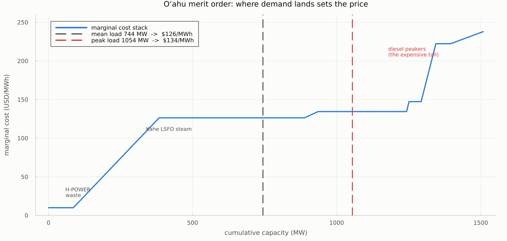
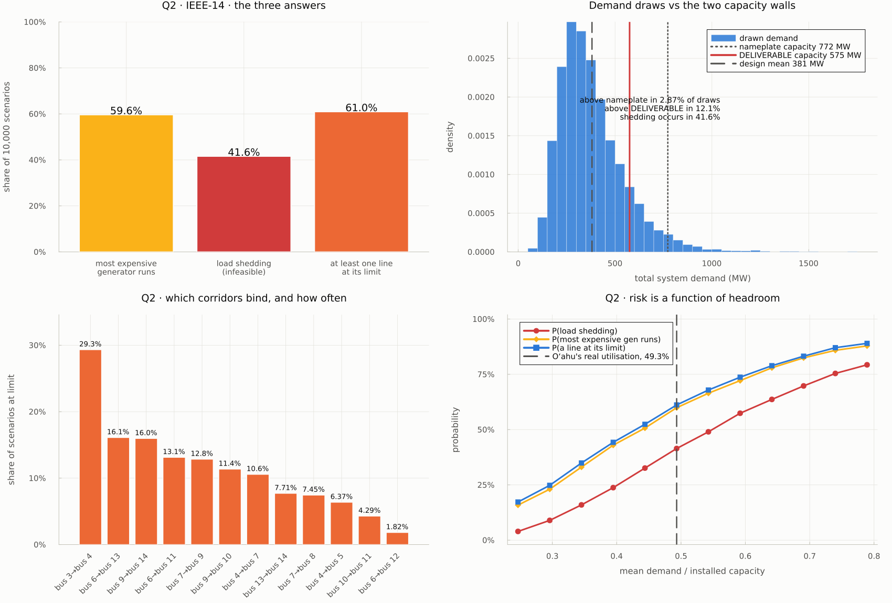
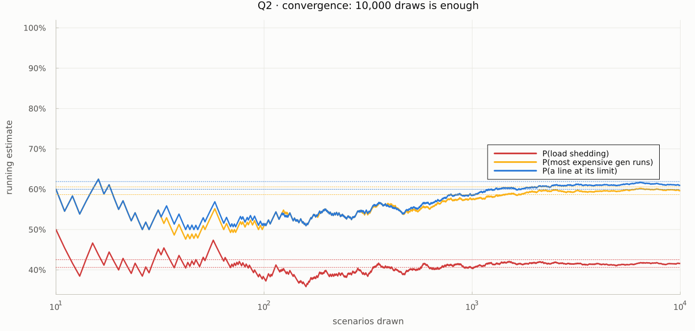
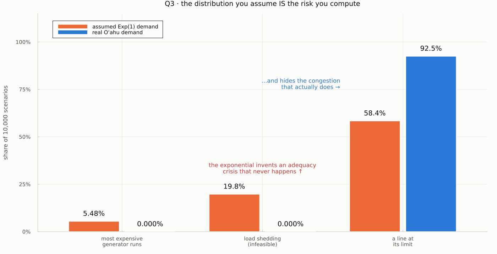
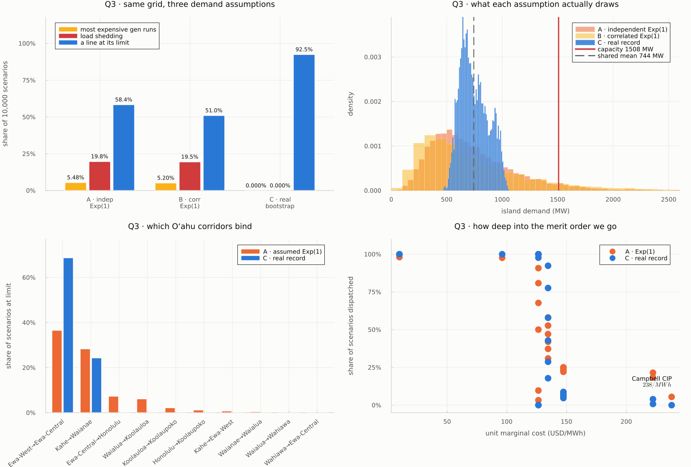
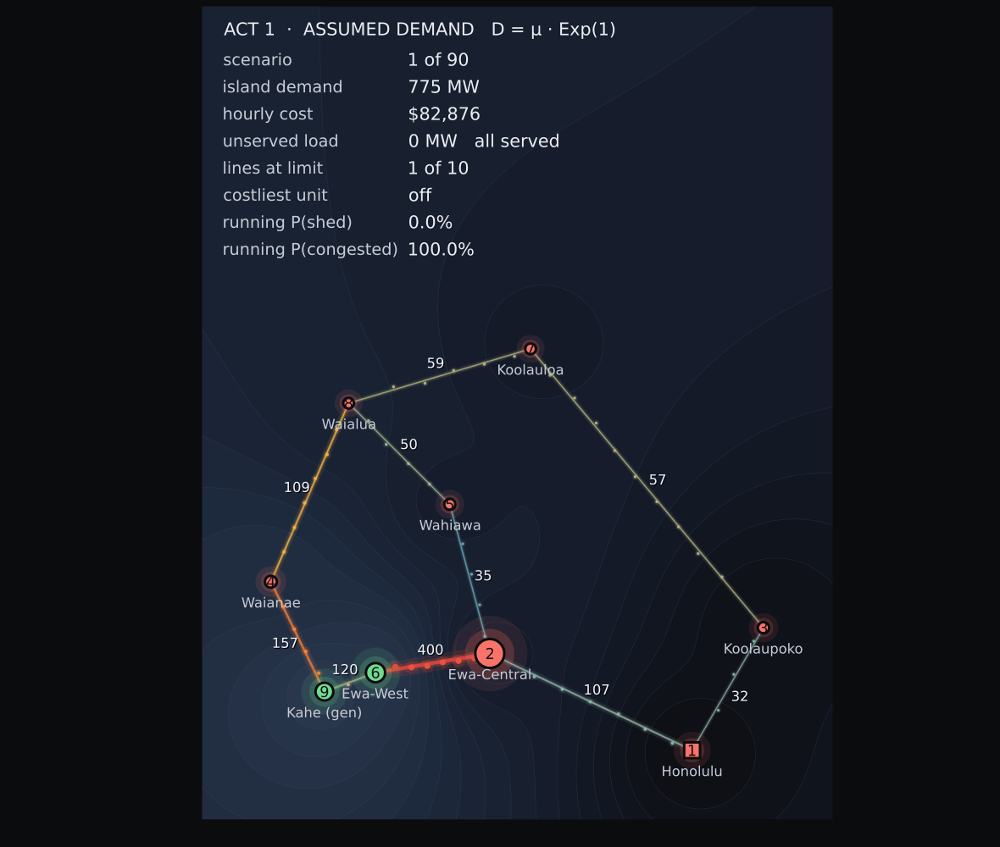

## Monte Carlo dispatch risk {.title-slide}

Set 8 · 8 September 2026

One network, ten thousand demand draws. What a fixed grid does when the demand column is random — and how much of the answer is the grid, versus the distribution we assumed.

  
10,000DC-OPF solves per experiment

  
2networks: IEEE-14 and Oʻahu

  
3demand models compared

Pascual Zárate · research with Adrian DeClerq · Julia + JuMP + HiGHS

::: {.notes}
Set 8 has three questions: is there real data (Q1), what does a toy network do under random demand (Q2), and what does the real network do (Q3). The punchline is that Q3 disagrees with Q2 in a way that is about the distribution, not the grid.
:::

---

## The experiment in one sentence

Hold the network completely fixed. Re-roll only the demand column. Solve. Repeat 10,000 times, and read the answer as a <strong>distribution</strong> rather than a number.

**Fixed** — topology, generator capacities and marginal costs, line ratings, the reference bus.

**Rolled** — demand at each node, drawn independently:

$D_i = \mu_i \cdot E_i, \qquad E_i \sim \mathrm{Exp}(1)$

So each node has mean $\mu_i$ and standard deviation $\mu_i$ — a **coefficient of variation of exactly 1**.

Three questions per run:

1. How often do we spin up the **most expensive** generator?
2. How often is the solution **infeasible** (load shedding)?
3. How often do network elements get **overloaded**?

::: {.notes}
The key modelling choice is on the next slide: we never let the solver return INFEASIBLE.
:::

---

## Never let the solver fail

A naive Monte Carlo calls the solver and counts `INFEASIBLE` returns. That is a bad instrument: it is a single bit, it says nothing about *how short* the system was, and solvers also return it for numerical reasons that have nothing to do with physics.

Instead every bus gets a load-shedding variable $S_i \in [0, D_i]$ priced at the value of lost load. The LP is then <strong>always feasible</strong>, and "infeasible" becomes a measured quantity.

$$\min \sum_g c_g P_g \;+\; \mathrm{VOLL}\sum_i S_i$$

$\sum S_i > 0$ &nbsp;⟶&nbsp; the network could not serve the draw, **and by how much**.

This is how reliability studies actually measure adequacy: expected unserved energy, not a boolean. VOLL is set to \$10,000/MWh — far above the costliest real unit (\$237.97/MWh) — so the optimiser only sheds when physically forced to.

::: {.notes}
Also: generator Pmin is set to zero. Oʻahu's fleet carries 531 MW of nameplate Pmin; enforcing it in a continuous LP without unit commitment would make low-demand draws infeasible for a reason unrelated to adequacy — you cannot switch a unit off. Stated as an assumption.
:::

---

## Q1 · Do we have real data? Yes.

Already assembled in this repository from primary filings:

- **8,760 hourly load observations** — Hawaiian Electric Final Oʻahu Inputs Workbook 3, 2021 base scenario
- **24 dispatchable units** — EIA-860 summer capacity, EIA-923 implied heat rates, HECO 2024 fuel forecast
- **9-bus network** — Census 2020 districts on Hawaiian Electric's published 138 kV two-corridor ring

743.9 MWannual mean net load

1,054 MWannual peak (21 Sep, 7 p.m.)

1,508 MWinstalled firm capacity

Provenance, checksums and caveats: <code>SOURCES.md</code> and <code>DATA_SOURCES.md</code>. Research model, not Hawaiian Electric's operational case.

---

## Q1 · And the data immediately complicates Q2

Real Oʻahu load has <strong>CV = 0.168</strong>. The Exp(1) we are told to assume has <strong>CV = 1.000</strong>. The assumption is roughly six times more volatile than the island has ever been.

::: {.notes}
Left: same mean, wildly different shape. The exponential's mode is at zero and its tail runs past 4x the mean. The real island never leaves roughly 0.6x-1.4x its own average. Right: the load duration curve — 8,760 hours all inside a 473-1,054 MW band.
:::

---

## Q1 · Where demand lands on the stack sets the price

H-POWER waste at \$10/MWh, then Kalaeloa combined cycle, then the Kahe and Waiau oil steam fleet, and finally diesel peakers at \$222–238/MWh. An average hour is served up to \$126/MWh; the annual peak reaches only \$134/MWh. <strong>The expensive tail is never touched by real demand.</strong>

---

## Q2 · Calibrating the toy to the island

The three questions are all questions about **headroom**, and headroom is governed by mean demand divided by installed capacity. Comparing a toy at its native 33.5% utilisation against a real island at 49.3% would compare the calibration, not the networks.

So IEEE-14 is given <strong>Oʻahu's utilisation</strong>: 49.3% of its 772.4 MW, or 380.98 MW, split across the eleven load buses in the published case14 proportions.

<strong>Line ratings.</strong> case14 publishes no thermal limits, and a network with no limits can never be congested — which would make question 3 vacuous. Ratings are assigned as in Part 3: 1.5× the flow each line carries at the design mean, floored at 25 MW. That is the network a planner would build for today's duty plus a margin.

---

## Q2 · The three answers, IEEE-14

  

    How often do we spin up the most expensive generator?
    59.6%
    95% CI 58.7–60.6% · the \$40/MWh tier
  

  

    How often is the solution infeasible (load shedding)?
    41.6%
    95% CI 40.6–42.6% · 8.29% of energy unserved
  

  

    How often does a network element hit its limit?
    61.0%
    1.39 of 20 lines binding per scenario
  

Demand exceeds total nameplate capacity in only <strong>2.9%</strong> of draws, yet shedding occurs in <strong>41.6%</strong>. The gap is the <strong>network</strong> failing to deliver power that the fleet could generate.

---

## Nameplate is the wrong yardstick

Chasing that gap produced the result I did not expect. "Installed capacity" adds up nameplate, but **a megawatt that cannot cross a line is not capacity**. So solve for the real ceiling:

$\max \alpha \quad \text{s.t. } D = \alpha\mu \text{ served with zero shedding, subject to every line rating}$

<h3>IEEE-14</h3>
772 MW → 575 MW
74.5% of nameplate. Bus 8 is radial behind a line whose rating landed on the 25 MW floor, so 75 of G5's 100 MW can never leave the bus.

<h3>Oʻahu</h3>
1,508 MW → 1,082 MW
71.7% of nameplate. <strong>426 MW of the fleet is stranded behind the Ewa corridor.</strong>

Oʻahu's peak is 1,054 MW. Against nameplate that is a <strong>43% cushion</strong>. Against what the network can actually deliver it is <strong>27.7 MW — 2.6%</strong>.

---

## Q2 · The full picture

Bottom-left: bus 3→4 binds in 29.5% of scenarios; it is the corridor that decides this network. Bottom-right: every probability is a smooth function of utilisation — which is why the calibration choice had to be made explicitly.

---

## Q2 · Is 10,000 enough?

Every Monte Carlo answer needs an error bar, or the last digits are decoration.

At $n = 10{,}000$ the Wilson 95% interval half-width is **±0.97 percentage points** on each of the three headline probabilities.

The traces flatten inside their own confidence bands well before 10,000 draws, so the answers are converged, not lucky.

---

## Q3 · The same questions, the real network

But first — Q1 already told us the exponential does not describe Oʻahu. So Q3 runs the **same network** under three demand models:

<table class="cmp-table">
<tr><th>demand model</th><th>CV</th><th>P(costliest unit)</th><th>P(shedding)</th><th>P(a line at limit)</th></tr>
<tr><td><strong>A</strong> · independent Exp(1) — the assignment's baseline</td><td>0.532</td><td>5.48%</td><td>19.77%</td><td>58.40%</td></tr>
<tr><td><strong>B</strong> · common island-wide shock, weight 0.7</td><td>0.708</td><td>5.20%</td><td>19.53%</td><td>51.05%</td></tr>
<tr class="hi"><td><strong>C</strong> · bootstrap from the real 8,760 hours</td><td>0.168</td><td>0.00%</td><td>0.00%</td><td>92.51%</td></tr>
</table>

The network never changed. Only the demand model did.

Model B is a mixture, $D_i = \mu_i(0.7 E_{\text{common}} + 0.3 E_i)$. Being precise: 0.7 is a <em>mixing weight</em>, not a correlation — it induces pairwise correlation 0.845 and cuts each node's CV to 0.762. So B moves two things at once and is a sensitivity, not a clean isolation of correlation. Its effect is on the <em>depth</em> of shedding (expected unserved rises 57 → 85 MW), not its frequency.

::: {.notes}
Model B exists because independence is the strongest assumption in the set and it is physically wrong — one island, one weather system, one clock.
:::

---

## Q3 · The finding

The exponential does not merely exaggerate risk. It <strong>misdirects</strong> it.

---

## Q3 · Why, in two parts

<h3>It invents an adequacy crisis</h3>
19.8% → 0.0%
Exp(1) draws demand from zero to three times the island average, so the fleet is regularly asked for more than it owns. Real Oʻahu demand never leaves the 473–1,054 MW band the fleet was <em>built</em> for. In 10,000 resampled real hours, load is served every single time.

<h3>…and hides the congestion</h3>
58.4% → 92.5%
Real load sits <em>persistently</em> in exactly the band that saturates the Ewa corridor. The exponential keeps wandering out of that band — often far below it — so it spends less time in the state where the network actually binds.

A fat-tailed assumption made the grid look fragile in a way it is not, and robust in a way it is not.

And note what "0.0% shedding" does <em>not</em> mean. Against deliverable capacity the real peak clears by only 2.6%. The island is safe in this model, but not comfortably so — and the thing standing between it and trouble is one 400 MW corridor, not the 426 MW of generation sitting behind that corridor.

---

## Q3 · The corridor that matters

<table class="cmp-table">
<tr><th>branch</th><th>rating</th><th>P(at limit) — Exp(1)</th><th>P(at limit) — real</th><th>mean utilisation — real</th></tr>
<tr class="hi"><td>Ewa-West → Ewa-Central</td><td>400 MW</td><td>36.6%</td><td>68.8%</td><td>0.977</td></tr>
<tr><td>Kahe → Waianae</td><td>200 MW</td><td>28.4%</td><td>24.4%</td><td>0.925</td></tr>
<tr><td>Waianae → Waialua</td><td>200 MW</td><td>0.5%</td><td>0.0%</td><td>0.734</td></tr>
<tr><td>Waialua → Koolauloa</td><td>200 MW</td><td>6.2%</td><td>0.0%</td><td>0.605</td></tr>
<tr><td>Ewa-Central → Honolulu</td><td>600 MW</td><td>7.5%</td><td>0.0%</td><td>0.470</td></tr>
</table>

Under real demand the leeward-to-Pearl-Harbour tie runs at <strong>97.7% of its rating on average</strong> and is pinned at the limit more than two-thirds of the time. Kahe's 582 MW and Ewa-West's 419 MW both sit behind it, and 84% of island load sits in front — so this is the corridor that strands 426 MW and turns a 43% reserve margin into 2.6%. In this model that single line, not generation capacity, is Oʻahu's binding constraint.

Stylised topology: 200 MW per 138 kV circuit is a labelled technology assumption, not a Hawaiian Electric rating. The <em>ranking</em> is the finding; the exact percentage inherits that assumption.

---

## Q3 · Oʻahu, all three models

---

## Watching the draws

<strong>Act 1</strong> assumed Exp(1) demand — buses swell and collapse, the fleet climbs into its diesel peakers, roughly one frame in five goes to blackout. <strong>Act 2</strong> real resampled hours — the lurching stops, shedding stops entirely, and the Ewa corridor stays red almost permanently. Bus positions are real population-weighted district centroids.

---

## Q2 vs Q3 · both at 49.3% utilisation

<table class="cmp-table">
<tr><th>case</th><th>nameplate</th><th>deliverable</th><th>demand CV</th><th>P(costliest)</th><th>P(shedding)</th><th>P(a line at limit)</th></tr>
<tr><td>IEEE-14, Exp(1)</td><td>772 MW</td><td>575 MW</td><td>0.444</td><td>59.6%</td><td>41.6%</td><td>61.0%</td></tr>
<tr><td>Oʻahu, Exp(1)</td><td>1,508 MW</td><td>1,082 MW</td><td>0.532</td><td>5.5%</td><td>19.8%</td><td>58.4%</td></tr>
<tr class="hi"><td>Oʻahu, real demand</td><td>1,508 MW</td><td>1,082 MW</td><td>0.168</td><td>0.0%</td><td>0.0%</td><td>92.5%</td></tr>
</table>

**Why does the toy shed 2× more at the same utilisation?**
IEEE-14's capacity sits in five lumpy units on five buses. Oʻahu's sits in 24 units with a deep, finely-graded merit order, so it absorbs a bad draw far more gracefully.

**Why is the costliest unit so rarely called on Oʻahu?**
Because 1,395 MW of cheaper capacity sits below it. Reaching Campbell CIP needs a draw in the top few percent — the toy's expensive tier starts at just 47% of stack.

---

## What I would do differently

**The distribution is a modelling decision, not a detail.** Exp(1) at every node was the specified starting point, and the honest result of running it is that it answers a question about a hypothetical island, not this one.

**Independence is the second-strongest assumption.** Model B shows a common shock leaves the *frequency* of shedding alone but nearly doubles its *depth* — the tail, not the probability, is where correlation shows up.

Better next steps, in order:

1. Fit the marginal per bus to the record, keep the empirical copula
2. Add unit commitment so Pmin means something
3. Add N-1 contingencies — the Ewa corridor result begs for it
4. Cross-check against the Texas A&M *Hawaii40* synthetic case

---

## Answers

  

    Q1 · Real network data?
    Yes
    8,760 filed hours; 24 units; 9 buses. Mean 743.9 MW, CV 0.168.
  

  

    Q2 · IEEE-14 under Exp(1)
    41.6%
    shedding · 59.6% costliest unit · 61.0% congestion
  

  

    Q3 · Oʻahu under real demand
    0.0%
    shedding · 0.0% costliest unit · but 92.5% congestion
  

The grid was never the variable. <strong>The distribution we assumed was.</strong>

Two things I would not have found without asking the question three ways: real Oʻahu demand causes <em>more</em> congestion than the fat-tailed assumption does, and the island's true reserve margin is 2.6% rather than 43% once you count only the megawatts the network can actually deliver.

Code: <code>Set 8/</code> — <code>montecarlo.jl</code>, <code>cases.jl</code>, <code>Q1–Q3</code>, <code>anim_set8.jl</code>. All figures and CSVs regenerate from <code>julia "Q1 - hawaii data.jl"</code> onward. Seed 20260908.

