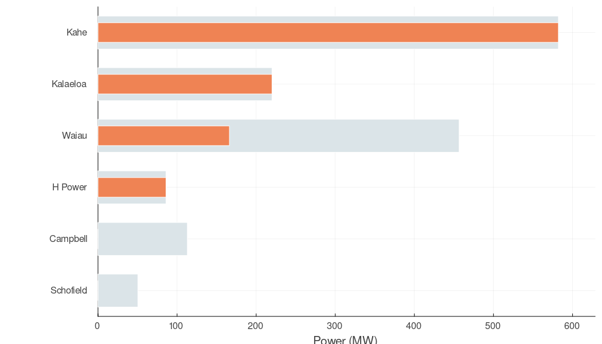
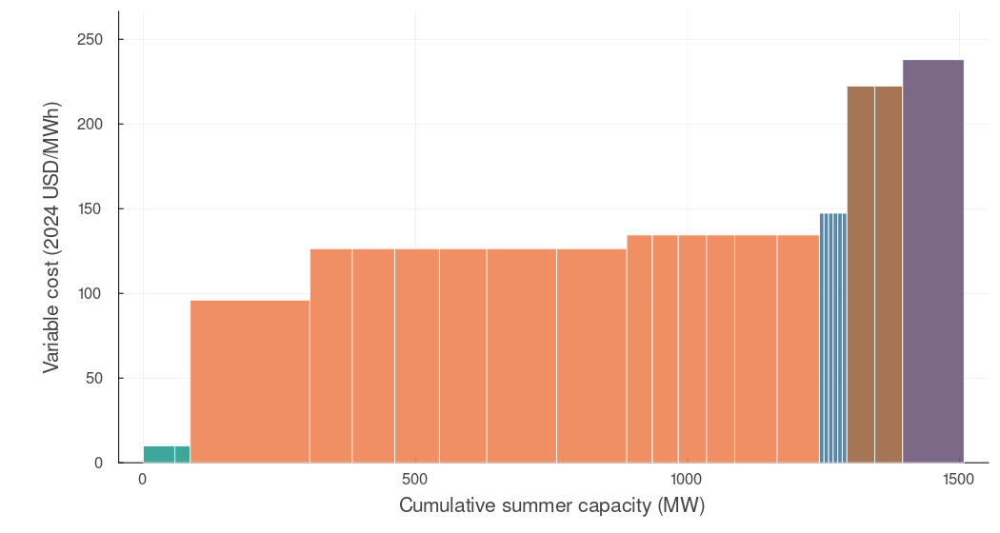
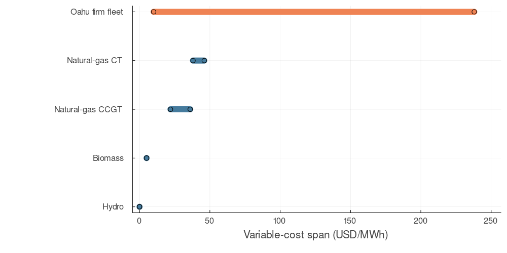
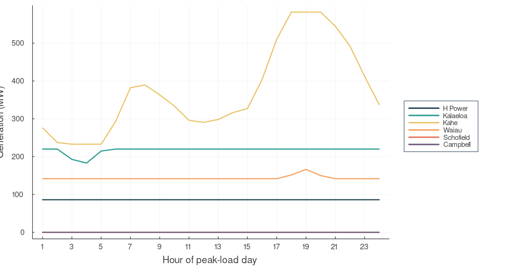
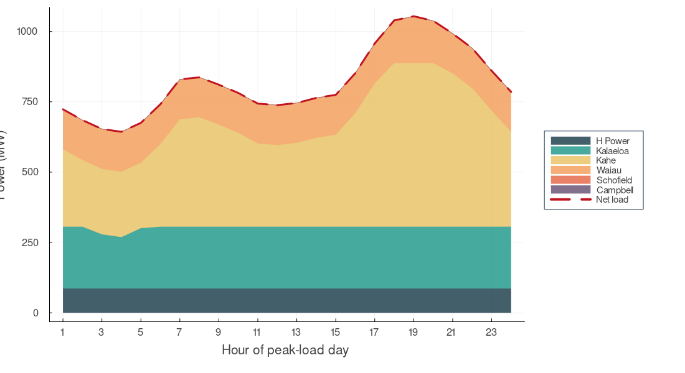
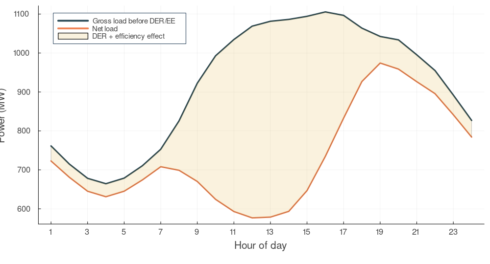
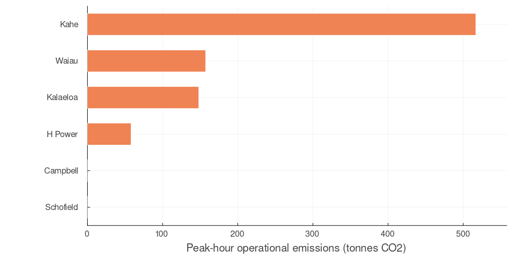

## Oʻahu economic dispatch {.title-slide}

<p class="kicker">A reproducible island-grid study</p>

<p class="subtitle">What real utility load, generator, fuel, and emissions data reveal about operating Hawaiʻi’s largest island system.</p>

<div class="metric-row">
  <div class="metric"><span class="value">1.05 GW</span><span class="label">modeled 2021 net peak</span></div>
  <div class="metric"><span class="value">24</span><span class="label">dispatchable resources</span></div>
  <div class="metric"><span class="value">8,760</span><span class="label">hourly load observations</span></div>
</div>

<div class="source">Research model — not a production unit-commitment or reliability study</div>

::: {.notes}
[Sources] Hawaiian Electric Final Oʻahu Inputs Workbook 3 (2022 filing); EIA Forms 860 and 923 (2024 final).
:::

## Isolation makes every operating choice local

<div class="two-col wide-left">
<div>

Oʻahu cannot lean on a neighboring balancing area when demand rises or a generator changes output.

The modeled fleet must satisfy every hour with resources located on the island—while carrying a cost structure shaped by imported petroleum fuels.

<div class="keyline">The annual net peak is <strong>1,054 MW</strong> at 7 p.m. on September 21 in the filed 2021 profile.</div>

</div>
<div>

<div class="metric"><span class="value">1,508 MW</span><span class="label">modeled firm summer capacity</span></div>
<div class="metric"><span class="value">454 MW</span><span class="label">capacity above the modeled peak</span></div>
<div class="metric"><span class="value">0 MW</span><span class="label">inter-island transfer in this formulation</span></div>

</div>
</div>

<div class="source">Peak is calculated from the HECO IGP 2021 base-scenario hourly layers; capacity is EIA-860 summer capacity.</div>

::: {.notes}
[Sources] Hawaiian Electric Final Oʻahu Inputs Workbook 3; EIA-860 2024 final generator data.
:::

## One auditable chain connects filings to results

<div class="two-col">
<div>

**Load**<br>
HECO IGP Workbook 3 → underlying demand + managed EV and e-bus load → DER, efficiency, storage, and TOU adjustments → gross and net 8,760.

**Fleet**<br>
EIA-860 unit status and summer capacity → utility/contracted Oʻahu resources → combined-cycle components aggregated physically.

</div>
<div>

**Economics**<br>
EIA-923 implied heat rates × HECO 2024 fuel-price forecast + technology VOM proxy.

**Environmental layer**<br>
HECO fuel CO₂ factors × heat rate; eGRID HIOA output rate used only as the H-POWER proxy.

<p class="small"><span class="assumption">Assumption boundary:</span> current public workbooks do not expose unit-level minimum-output and hourly ramp values. Technology defaults are explicit in every fleet row.</p>

</div>
</div>

<div class="source">Complete file names, URLs, vintages, transformations, exclusions, and checksums are in SOURCES.md.</div>

::: {.notes}
[Sources] Hawaiian Electric IGP filing; EIA-860 2024; EIA-923 2024; EPA eGRID2023; NREL ATB 2024.
:::

## Six plants define the modeled firm fleet

| Plant group | Technology / fuel | Resources | Summer MW | Variable cost range |
|---|---|---:|---:|---:|
| H-POWER | Steam / municipal waste | 2 | 86.0 | $10/MWh* |
| Kalaeloa | Combined cycle / LSFO | 1 | 220.0 | $96/MWh |
| Kahe | Steam / LSFO | 6 | 582.1 | $126/MWh |
| Waiau | Steam + CT / LSFO + diesel | 8 | 456.6 | $134–222/MWh |
| Schofield | Reciprocating / ULSD | 6 | 50.4 | $147/MWh |
| Campbell | CT / ULSD | 1 | 113.0 | $238/MWh |

<p class="small">*H-POWER uses a zero fuel-price assumption plus a $10/MWh VOM proxy. All minimum-output and ramp-rate cells are <span class="assumption">assumed</span>. Airport emergency and refinery self-generation are excluded; renewable and storage output is embedded in net load rather than dispatched here.</p>

<div class="source">EIA-860/923 2024 final; HECO IGP 2024 fuel-price forecast; technology VOM proxy. Rounded values.</div>

::: {.notes}
[Sources] EIA-860 2024 final; EIA-923 2024 final; Hawaiian Electric Final Oʻahu Inputs Workbook 3; NREL ATB 2024.
:::

## The model preserves the lecture’s logic

<div class="two-col">
<div>

Single period:

$$\min_y \sum_g c_g y_g$$

$$\sum_g y_g = D,\qquad P_g^{min}\le y_g\le P_g^{max}$$

Multi-period adds:

$$-R_g \le y_{g,t+1}-y_{g,t}\le R_g$$

</div>
<div>

```julia
@variable(model,
  p_min[g] <= y[g in G, t in T] <= p_max[g])

@objective(model, Min,
  sum(cost[g] * y[g,t] for g in G, t in T))

@constraint(model, balance[t in T],
  sum(y[g,t] for g in G) == demand[t])
```

<p class="small">Both formulations are linear programs solved with JuMP + HiGHS. This is economic dispatch with continuous output—not binary unit commitment.</p>

</div>
</div>

<div class="source">Formulation follows Cornell BEE 4750/5750 Economic Dispatch; implementation in src/EconomicDispatch.jl.</div>

::: {.notes}
[Sources] Vivek Srikrishnan, Cornell BEE 4750/5750 Economic Dispatch lecture; repository model code.
:::

## At peak, Waiau W8 is marginal

<div class="two-col wide-left">
<div class="figure">

{fig-alt="Peak-hour dispatch and available capacity by Oahu plant group"}

</div>
<div>

<div class="metric"><span class="value">1,054 MW</span><span class="label">net load served</span></div>
<div class="metric"><span class="value">$134/MWh</span><span class="label">marginal cost</span></div>
<div class="metric"><span class="value">$117,913/h</span><span class="label">modeled variable cost</span></div>

<p class="small">Orange = dispatched output; gray = available summer capacity.</p>

<p class="small">H-POWER, Kalaeloa, and all six Kahe units reach modeled maximum output. Waiau W8 supplies the final increment.</p>

</div>
</div>

<div class="source">Model output for hour 6,331 of the HECO IGP 2021 base profile; values rounded.</div>

::: {.notes}
[Sources] Repository outputs data/processed/single_period_dispatch.csv and analysis_summary.csv.
:::

## Oil turns merit order into an efficiency and fuel-grade contest

<div class="two-col">
<div class="figure">

{fig-alt="Oahu dispatchable fleet merit order"}

</div>
<div class="figure">

{fig-alt="Textbook technology cost spans compared with Oahu firm fleet"}

</div>
</div>

<div class="keyline">The oil fleet spans <strong>$96–238/MWh</strong> even without broad fuel diversity: heat rate and LSFO-versus-distillate prices create the separation.</div>

<div class="source">Oʻahu costs: EIA-923 heat rates + HECO 2024 fuel-price forecast + VOM proxy. Textbook spans reproduce the lecture’s illustrative generator inputs.</div>

::: {.notes}
[Sources] EIA-923 2024; Hawaiian Electric IGP Workbook 3; NREL ATB 2024; Cornell BEE 4750/5750 Economic Dispatch lecture.
:::

## Ramping links one hour’s choice to the next

<div class="two-col">
<div class="figure">

{fig-alt="Generation by plant group over the 24-hour peak-load day"}

</div>
<div class="figure">

{fig-alt="Stacked dispatch with net load overlaid"}

</div>
</div>

The 24-hour model serves every hour and respects each stated output and ramp bound. Expensive fast-start units remain unnecessary on this day under the assumed available fleet.

<div class="source">JuMP + HiGHS result for the September 21, 2021 peak-load day; ramp parameters are technology assumptions.</div>

::: {.notes}
[Sources] Repository outputs data/processed/multi_period_dispatch.csv; assumptions in data/processed/oahu_generators.csv.
:::

## Distributed resources carve out the daytime load

<div class="two-col wide-left">
<div class="figure">

{fig-alt="Gross and net Oahu load on the day with the largest DER and efficiency effect"}

</div>
<div>

Day 261—September 18—has the year’s largest hourly gap between modeled gross and net load.

The gap combines distributed PV, customer batteries, efficiency, and time-of-use effects from HECO’s own base-scenario layers.

<div class="keyline">This is an Oʻahu curve reconstructed from filed components, not a California curve transplanted into the analysis.</div>

</div>
</div>

<div class="source">HECO Final Oʻahu Inputs Workbook 3, 2021 base-scenario 8,760 layers.</div>

::: {.notes}
[Sources] Hawaiian Electric Final Oʻahu Inputs Workbook 3, filed March 31, 2022.
:::

## Peak-hour emissions concentrate in oil steam generation

<div class="two-col wide-left">
<div class="figure">

{fig-alt="Operational carbon dioxide emissions by plant group in the peak hour"}

</div>
<div>

<div class="metric"><span class="value">880 tCO₂</span><span class="label">modeled peak-hour emissions</span></div>
<div class="metric"><span class="value">16,108 tCO₂</span><span class="label">modeled peak-day emissions</span></div>

<p class="small">Fuel-specific CO₂ factors are multiplied by EIA-923 heat rates. H-POWER uses the eGRID HIOA average as a proxy, so plant-group values are indicative—not emissions-inventory estimates.</p>

</div>
</div>

<div class="source">HECO IGP fuel factors; EIA-923 heat rates; EPA eGRID2023 HIOA output rate for H-POWER proxy.</div>

::: {.notes}
[Sources] Hawaiian Electric Final Oʻahu Inputs Workbook 1; EIA-923 2024; EPA eGRID2023 Summary Tables revision 2.
:::

## The result is a transparent baseline—not an operating forecast

<div class="two-col">
<div>

**What the model establishes**

- A reproducible 8,760-hour Oʻahu load dataset
- A traceable 2024 dispatchable-fleet table
- Feasible single- and multi-period economic dispatch
- Cost, ramping, duck-curve, and emissions views from the same inputs

</div>
<div>

**What should come next**

- Replace assumed unit constraints with confidential or newly filed values
- Add binary commitment, start costs, minimum up/down time, reserves, and outages
- Co-optimize Kapolei Energy Storage instead of embedding storage in net load
- Test transition scenarios, including historical AES operation, as separate vintages

</div>
</div>

<div class="keyline">The island-grid story is not merely “dispatch the cheapest fuel.” Flexibility, storage, and operational constraints determine how the system absorbs cleaner supply.</div>

<div class="source">Scope and limitations are documented in SOURCES.md and README.md.</div>

::: {.notes}
[Sources] Repository methodology and source documentation.
:::
